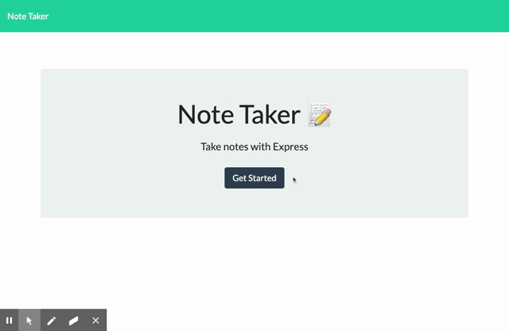

# note-taker

# Description
Note Taker is an interactive application using node.js, express.js, File System Module, and Javascript. On the main page once you click get started you will be taken to the note section of the app. You can view old notes, write and save new notes, and delete unwanted notes. Starter code was provided for the frontend, while the backend was developed using Express.js to complete api calls getting the required html/css/js files, as well as getting, and editing (post/delete) a JSON file to store the notes. The live application can be viewed [here](https://peaceful-inlet-22268.herokuapp.com/). Come check it out!

# Table of Contents
- [Installation](#installation)
- [Usage](#usage)
- [License](#license)
- [Contributing](#contributing)
- [Tests](#tests)
- [Questions](#questions)

# Installation
If the code is cloned run 'npm install' then 'node server.js' to start the server. You can also view the live application [here](https://peaceful-inlet-22268.herokuapp.com/).

# Usage
Write, save, and delete notes all in one simple application.

# License
This project is covered by the [MIT](https://spdx.org/licenses/MIT.html) license.

# Contributing
Michael Humpherys

# Tests
Currently there are no test developed for this application.

# Questions
Feel free to contact me with any questions at my email or GitHub. [Email](mailto:mrhumpherys@gmail.com), [GitHub](https://github.com/mrhumpherys)